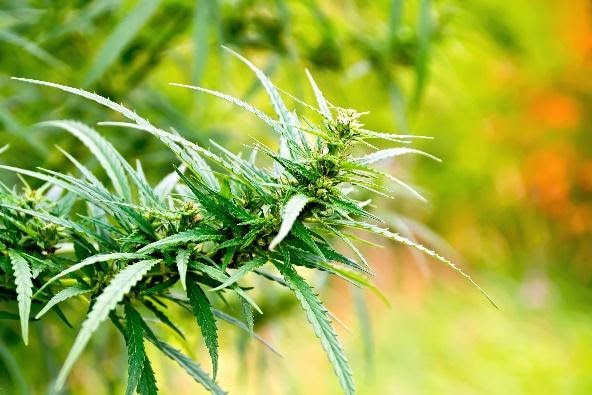

# Hemp Cultivation: Outdoor Vs. Greenhouse Vs. Indoor Flower

Creating and growing a hemp-derived CBD retail store is challenging. Purchasing the flower is an exhilarating part of the business venture. The problem is — with an unreliable supply chain and inconsistent pricing — how do you know what hemp to purchase for your retail store?

There are three main hemp cultivation methods: indoor, outdoor (full-term sun-grown), and greenhouse (sun-grown with light deprivation). Many individuals are prone to think — it should not matter where hemp is grown, as long as it gets to your shelves. Research proves different. 

Does hemp grown in different conditions manifest varied properties? Which growing conditions produce the best hemp? And what is the price-point for each method of cultivation? Here’s what you need to know.

## Indoor Hemp Cultivation

Indoor hemp cultivation is easier to manage when compared to the outdoor and greenhouse options. Indoor-grown hemp tends to be far less susceptible to things like mold, mildew — and pests. Not to mention indoor-grown hemp isn’t exposed to unpredictable weather conditions. Indoor hemp growers have complete control of the entire production process, including air temperature and quality. Analyze indoor cultivated hemp, and you’ll see it looks cleaner — and leaves are less weathered. 

Indoor-grown hemp flower is premium in every sense — aroma, appearance, and trim. Indoor plants are spoiled with enhanced ventilation, a scrutinized atmosphere, artificial light cycles, and meticulously calculated nutrient supplements. These key micro-adjustments boost every aspect of a plant’s growing condition. Indoor-grown hemp tends to be much more expensive for retailers and can potentially price out a number of your consumers in the store. This is the most expensive method of growing, and it comes with a premium price tag. 

Elevating Trading Insider Tip: Do your research on your customer base. Do you have a large number of educated buyers that will appreciate a more boutique approach to hemp flower and pay the associated premium prices? Do you have a store aesthetic and employees that know hemp flower so well they can walk a customer through the differences in grow methods? Get involved. Understand the ins and outs of where your hemp is grown and how that translates to a sale in your store. 

## Outdoor Hemp Cultivation

The challenging element of outdoor hemp cultivation is worth its weight in gold — as it can significantly enhance flavor, aroma, and experience. Outdoor-produced flower will always revel in a broader, more concentrated, deeply penetrative spectrum of light. Not only does the sunlight and fresh-air lift outdoor-grown hemp, but the significant amount of outdoor space also allows plants to attain its full genetic capacity. 

Full-term outdoor hemp cultivation is the most natural and least expensive way to grow hemp — no lights, no fans, no tarps, and only uses tents, sunlight, and soil. But make no mistake about it, it can compete with indoor strains in terms of aroma, aesthetics, and cannabinoid content. The advantage here is the lower cost is passed onto the retailer and end-user. 

Elevated Trading Insider Tip: Do your research. With outdoor growing environments come pests and contaminants. Does the cultivator have the time and inclination to observe the plants? Outdoor-grown hemp tends to be more susceptible to undesired growths, but an experienced grower can create some truly spectacular material when the grow is maintained properly through harvest. Engage and consume yourself with the ins and outs of where and how your hemp is grown.

## Greenhouse Hemp Cultivation

Finally — sun-grown with light deprivation, also known as greenhouse hemp, is protected from the sun's damaging UV rays. Light deprivation allows hemp growers to block out the sun with tarps, deceiving plants into maturing faster. 

When cultivated precisely, greenhouse hemp growers can modify humidity, temperature, and light to produce superior hemp. On the downside, retailers and end users absorb the difference in costs as the expense of greenhouse hemp can be substantially larger.

Elevated Trading Insider Tip: Do your research. Will you be able to get your hands-on your best-selling products year-round? The drawback to greenhouse hemp is that growers have to work within the confines of their greenhouse, and this often leads to limited, boutique quantities of products. If you’re investing time, effort, and energy into the packaging for a particular strain, you need to ensure that it will be available year round. Be in the know when it comes to cultivation. Make the time to understand the ins and outs of greenhouse hemp.

## Which Hemp Cultivation Method is Right for You?

There is no perfect hemp cultivation method. It comes down to individual retailer preference and an understanding of your consumers in your individual market. For retailers who choose experience over everything, indoor may be the better choice. Indoor-grown hemp typically produces flower with higher potency and a much higher price point. 

For retailers who want to deliver the highest value to their customer for a fair price, the answer may be outdoor-grown hemp, which is the most natural and economical way of growing flower. Greenhouse-grown hemp has the potential to produce more generous amounts of terpenes and cannabinoids, but comes with a higher price tag than outdoor flower. 

The most important factor in choosing a cultivation method is trusting the supplier. Working with a supplier who manufactures high-quality, unpolluted hemp — allows you a genuine seed-to-sale process that you and your customers can trust. Retailers with a solid reputation will source their hemp from farmers that cultivate hemp in harmony with the highest cultivation standards.

Narrow down your options — and arrange a trip to the supplier’s cultivation facility. This will grant you an inside look at different cultivation methods and how safely they conduct business in accordance with applicable laws. The hemp market is filled with electrifying new strains, flavor profiles, and effects, regardless of the cultivation method. It’s your responsibility to demand quality, superior strain variety, and high compliance standards from your hemp flower provider. It’s time to elevate.