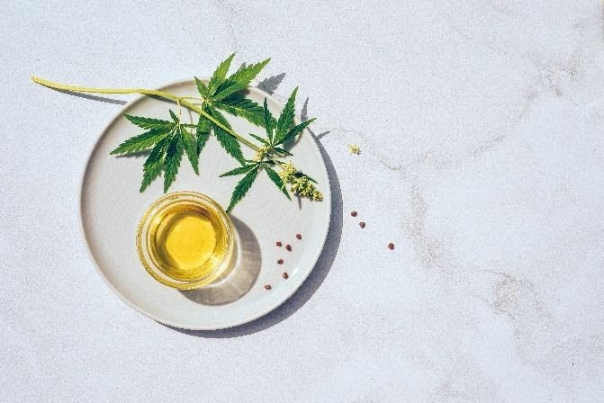

# Terpenes: Definition, Uses, and Effects

One of the most significant aspects of living in the current age is witnessing the hemp industry’s growing field of cannabinoid research.

Most of the research into hemp’s therapeutic benefits focuses on cannabinoids — CBD, CBN, CBG, CBC, and THC. 

Besides cannabinoids, there is a fascinating hemp compound with just as great of medicinal benefits that is overlooked — terpenes. Known for their potent aromatic characteristics, terpenes are what provide various hemp strains with exclusive flavor profiles. Beyond infusing hemp with unique tastes and smells, researchers deem terpenes to play a vital role in the future of [hemp products](https://www.elevatedtrading.com/products).

It’s crucial to offer your consumers revolutionary, proprietary effect-based terpene profiles to enhance consumer quality of life in target areas such as relaxation, vitality, and focus. In doing so, it’s essential to understand key terms — specifically, terpenes. Knowing this and what to look for is the first step to sourcing quality and compelling aromatics for your retail products.

## What are Terpenes?

Let’s talk technical terms. Terpenes are classified as hydrocarbons with the following molecular structure: (C5H8)n. Plants and insects produce this diverse group of hydrocarbons for fascinating evolutionary motivations.

Non-scientifically, terpenes are aromatic oils that give hemp its distinctive flavor profiles, such as sweet, spicy, sour, — or bitter. The incredible compound often gives off a strong scent. Hemp and cannabis naturally produce several terpenes, which is why so many strains smell and taste different from one another.

Elevating Trading Insider Tip: For a terpene to transform into an activated form, it needs to be heated to a certain point. It is essential to understand the exact boiling point for terpenes and cannabinoids present in hemp products. Educate your customers — without this knowledge, they may not receive the full therapeutic benefit of terpenes.

## How are Terpenes Used?

Terpenes are an incredibly diverse group of compounds that serve many uses. They are used mostly as flavoring agents or for their aromatic qualities and are added to food and beverage products.

Playing a crucial role in differentiating the effects of various strains — some terpenes encourage relaxation and stress-relief, while others promote focus and sharpness.

The effect profile of any given terpene may change in the presence of other compounds in a phenomenon known as the entourage effect. Terpenes can add tremendous depth to the viticultural art and connoisseurship of hemp flower. They may also add therapeutic and medicinal value, based on their unique properties.

## How Terpenes Affect the Experience?

Variations in terpene strains and content significantly alter the physiological effects that hemp has on a user. What does this mean? Terpenes enhance the benefits of CBD hemp via the endocannabinoid system. When combined with CBD, terpene blends create a more balanced and pleasant experience and encourage users to be more focused, have more energy, or be calmer. 

Let’s check out the different types of terpenes:

### Myrcene

Aroma: Earthy, cloves, musky

Vaporizes: 332ºF (167ºC)

Potential effects: Calming, sedating, relaxing

### Limonene

Aroma: Citrus

Vaporizes: 348ºF (176ºC)

Potential effects: Heightened mood, elevated ambiance, fight depression, anxiety and stress relief

### Caryophyllene

Aroma: Pepper, spicy, woody

Vaporizes: 266ºF (130ºC)

Potential effects: Anxiety and stress relief

### Terpinolene

Aroma: Piney, floral, herbal

Vaporizes: 366ºF (186ºC)

Potential effects: Elevates mood, good uplifting vibes, motivating

Pinene

Aroma: Pine

Vaporizes: 311ºF (155ºC)

Potential effects: More alert, memory preservation, counteracts some THC effects

### Humulene

Aroma: Woody, earthy

Vaporizes: 222ºF (106ºC)

### Ocimene

Aroma: Sweet, herbal, woody

Vaporizes: 122ºF (50ºC)

### Linalool

Aroma: Floral

Vaporizes: 388ºF (198ºC)

Potential effects: Memory and mood enhancement, sedation, relaxing

High-Quality Hemp Strains

Researchers are only scraping the surface of the many potential benefits of terpenes found in hemp flower — researchers have yet to unlock the full potential of what terpenes bring to the table.  

**The increasing popularity of terpene is a vital aspect to consider when investing in the hemp industry, as retail prices will inevitably affect terpene content. At [Elevated Trading](www.ElevatedTrading.com), we offer a wide assortment of CBD distillates and isolates, as well as wholesale CBD hemp flowers. Up your game. Elevate!**